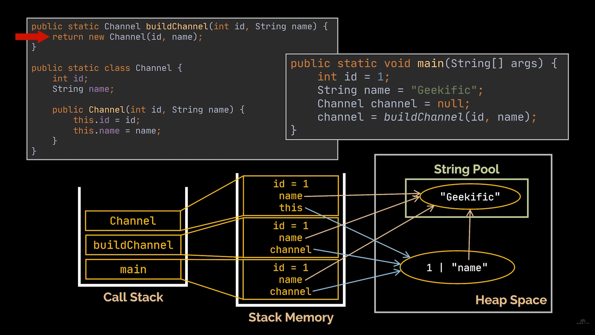

# Java

## Call Stack, Stack Memory and Heap Space

### Call Stack

The call stack in Java is a data structure used by the Java Virtual Machine (JVM) to keep track of method calls during the execution of a program. It is a LIFO (Last-In-First-Out) stack where each method call is added to the top of the stack, and when a method returns, it is removed from the top of the stack.

### Stack 

In Java, the stack is a region of memory that is used to store method calls and local variables. Each thread in a Java program has its own stack, which is used to manage method calls and to store local variables for those methods.

When a method is called, a new frame is added to the top of the stack to hold the method's local variables, its parameters, and its return address. The return address is the address of the instruction to execute after the method returns.

When a method completes its execution, its frame is removed from the top of the stack, and control is returned to the calling method at the return address.

The stack is a LIFO (Last-In-First-Out) data structure, which means that the most recently added method frame is at the top of the stack and is the first to be removed when the method returns.

The size of the stack is limited, and if it exceeds its maximum size, a StackOverflowError is thrown. It is important to properly manage the size of the stack to avoid StackOverflowError and to ensure efficient operation of the program.

In summary, the stack in Java is a region of memory that is used to manage method calls and to store local variables. Each thread has its own stack, and the size of the stack is limited. Proper management of the stack is important to ensure efficient operation of Java programs.

### Heap 

In Java, the heap is a region of memory that is used to store objects and is managed by the Java Virtual Machine (JVM). The heap space is divided into two areas: the young generation and the old generation.

The young generation is where new objects are created, and it is further divided into two areas: the Eden space and the survivor spaces. The Eden space is where new objects are created, and the survivor spaces are used to hold objects that have survived one or more garbage collection cycles.

The old generation is where long-lived objects are stored, and it is also known as the tenured generation. Objects that have survived several garbage collection cycles are moved from the young generation to the old generation.

The heap space is managed by the garbage collector, which automatically frees up memory by removing objects that are no longer being used. The garbage collector periodically scans the heap space, identifies unused objects, and releases the memory occupied by those objects.

It is important to properly configure the heap space for a Java application to ensure that it has enough memory to run efficiently. If the heap space is too small, the application may run out of memory, resulting in an OutOfMemoryError. Conversely, if the heap space is too large, it may cause the garbage collector to take longer to free up memory, resulting in longer pauses in the application's execution.

In summary, the heap space in Java is where objects are stored, and it is divided into the young generation and the old generation. The garbage collector manages the heap space, freeing up memory by removing unused objects. Proper configuration of the heap space is important to ensure efficient operation of Java applications.

## Design Patterns 

### Creational

### Structural

### Behavioral 

