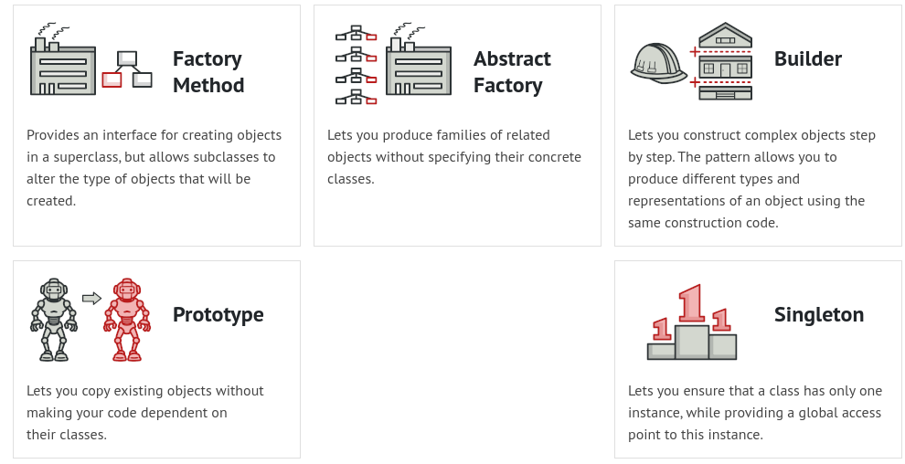
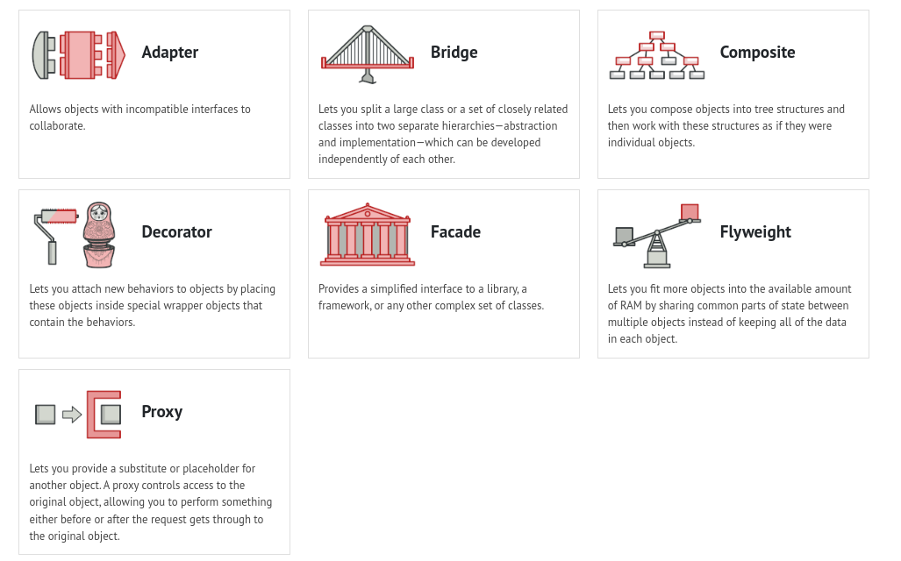
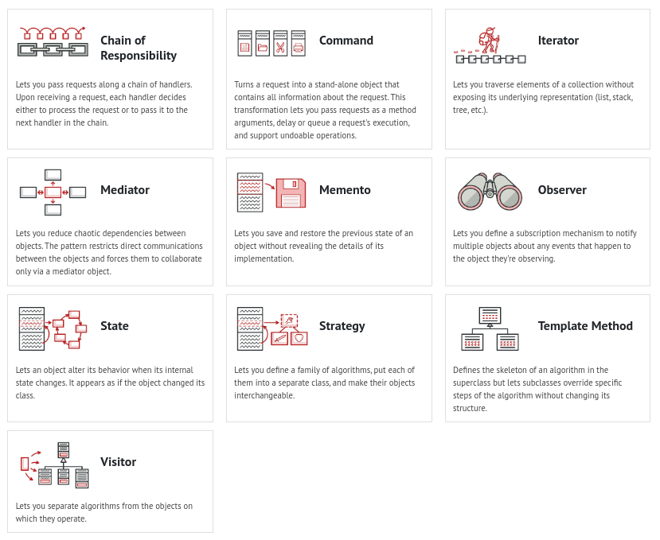

# Java

## Call Stack, Stack Memory and Heap Space

### Call Stack

The call stack in Java is a data structure used by the Java Virtual Machine (JVM) to **keep track of method calls during the execution** of a program. It is a LIFO (Last-In-First-Out) stack where each method call is added to the top of the stack, and when a method returns, it is removed from the top of the stack.

### Stack 

In Java, the stack is a region of memory that is used to **store method calls and local variables**. Each thread in a Java program has its own stack, which is used to manage method calls and to store local variables for those methods.

When a method is called, a new frame is added to the top of the stack to hold the method's local variables, its parameters, and its return address. The return address is the address of the instruction to execute after the method returns.

When a method completes its execution, its frame is removed from the top of the stack, and control is returned to the calling method at the return address.

The stack is a LIFO (Last-In-First-Out) data structure, which means that the most recently added method frame is at the top of the stack and is the first to be removed when the method returns.

The size of the stack is limited, and if it exceeds its maximum size, a StackOverflowError is thrown. It is important to properly manage the size of the stack to avoid StackOverflowError and to ensure efficient operation of the program.

In summary, the stack in Java is a region of memory that is used to manage method calls and to store local variables. Each thread has its own stack, and the size of the stack is limited. Proper management of the stack is important to ensure efficient operation of Java programs.

### Heap 

In Java, the heap is a region of **memory that is used to store objects** and is managed by the Java Virtual Machine (JVM). The heap space is divided into two areas: the young generation and the old generation.

The young generation is where new objects are created, and it is further divided into two areas: the Eden space and the survivor spaces. The Eden space is where new objects are created, and the survivor spaces are used to hold objects that have survived one or more garbage collection cycles.

The old generation is where long-lived objects are stored, and it is also known as the tenured generation. Objects that have survived several garbage collection cycles are moved from the young generation to the old generation.

The heap space is managed by the garbage collector, which automatically frees up memory by removing objects that are no longer being used. The garbage collector periodically scans the heap space, identifies unused objects, and releases the memory occupied by those objects.

It is important to properly configure the heap space for a Java application to ensure that it has enough memory to run efficiently. If the heap space is too small, the application may run out of memory, resulting in an OutOfMemoryError. Conversely, if the heap space is too large, it may cause the garbage collector to take longer to free up memory, resulting in longer pauses in the application's execution.

In summary, the heap space in Java is where objects are stored, and it is divided into the young generation and the old generation. The garbage collector manages the heap space, freeing up memory by removing unused objects. Proper configuration of the heap space is important to ensure efficient operation of Java applications.

## Design Patterns 

### Creational

### Structural

### Behavioral 

## Java Concepts

### Inheritance
In Java, inheritance allows a **subclass** to inherit the properties and behaviors of a **superclass**. This means that the subclass can use all the methods and variables of the superclass, as well as any additional methods and variables that it defines. Inheritance is achieved through the use of the **"extends"** keyword in Java.

### Polymorphism
Polymorphism is the ability of objects to take on many forms. In Java, polymorphism is achieved **through the use of inheritance and interfaces**. Polymorphism **allows objects of different classes to be treated as if they were objects of the same class**, which can make code more flexible and easier to maintain.

### Abstract Classes
An abstract class is a class that **cannot be instantiated**, but **can be used as a template** for other classes. Abstract classes can contain both concrete methods and abstract methods, which must be implemented by any subclass that extends the abstract class.

### Interfaces
An interface is a **collection of abstract methods** that define a **contract** for implementing classes. In Java, a class can implement multiple interfaces, which allows for greater flexibility and code reuse.

### Overriding
Overriding is the process of **providing a new implementation** for a **method that already exists** in a superclass or interface. When a method is overridden in a subclass, the subclass method takes precedence over the superclass method.

### Overloading
Overloading is the process of creating **multiple methods with the same name but different parameters**. Java determines which method to use based on the type and number of parameters passed to the method.

## Exceptions

In Java, an exception is an event that occurs during the execution of a program that disrupts the normal flow of the program's instructions. When an exception occurs, the program terminates abnormally and an error message is displayed.

Exceptions can be caused by a variety of factors, such as invalid user input, hardware errors, or programming mistakes. Java provides a robust system for handling exceptions through the use of try-catch blocks.

The try block contains the code that might throw an exception, while the catch block contains the code that handles the exception if it is thrown. If an exception is thrown within the try block, Java looks for a corresponding catch block that can handle that particular exception. If no catch block is found, the program terminates and an error message is displayed.

Java also provides a hierarchy of exception classes, with the most general exception class being "Exception". This allows for more specific exceptions to be caught and handled separately from more general exceptions. This enables programmers to write more robust and fault-tolerant code by handling exceptions in a controlled and systematic way.

### Exceptions Types

https://www.youtube.com/watch?v=bCPClyGsVhc

In Java, there are two main types of exceptions: checked exceptions and unchecked exceptions.

#### Checked exceptions 
Checked exceptions are exceptions that are checked by the compiler at compile-time. They are typically caused by external factors that are beyond the control of the program, such as I/O errors, network errors, or file errors.
Examples of checked exceptions in Java include:

- IOException
- SQLException
- ClassNotFoundException
- InterruptedException

#### Unchecked exceptions 
Unchecked exceptions are exceptions that are not checked by the compiler at compile-time, and instead occur at runtime. They are typically caused by programming mistakes, such as null pointer dereference, division by zero, or array index out of bounds.

Examples of unchecked exceptions in Java include (inherited from **RuntimeException**):

- NullPointerException
- ArithmeticException
- ArrayIndexOutOfBoundsException
- IllegalArgumentException

In addition to these two main types, Java also provides a hierarchy of exception classes, with the most general exception class being "Exception". This allows for more specific exceptions to be caught and handled separately from more general exceptions, providing greater flexibility and control over exception handling in Java programs.

## Memory Optimizations Advices 

Memory optimization is an important aspect of Java programming, as it can greatly improve the performance and scalability of a program. Here are some tips for optimizing memory usage in Java:

1. **Use efficient data structures**: Choose the appropriate data structure for your program's needs, taking into account the data size, access patterns, and operations performed on the data. For example, using an ArrayList instead of a LinkedList for large collections can save memory and improve performance.

1. **Avoid creating unnecessary objects**: Objects consume memory, and creating too many unnecessary objects can cause the garbage collector to work harder, leading to longer pause times and decreased performance. Use object pooling or caching to reuse objects instead of creating new ones.

1. **Use primitive types instead of objects**: Primitive types consume less memory than their corresponding object types. For example, using int instead of Integer can save memory.

1. **Use the right garbage collector**: Choose the appropriate garbage collector for your program's needs, taking into account the size of the heap, the number of objects, and the performance requirements. Experiment with different garbage collectors and tuning parameters to find the best configuration for your program.

1. **Tune the heap size**: Set the heap size appropriately for your program's needs to avoid OutOfMemoryError or excessive garbage collection. Use the -Xms and -Xmx command-line options to set the initial and maximum heap size.

1. **Use memory profiling tools**: Use memory profiling tools such as jstat, jmap, and VisualVM to identify memory leaks and other memory-related issues in your program.

1. **Optimize IO operations**: Use buffered IO streams and avoid unnecessary IO operations to reduce memory usage and improve performance.

In summary, Java memory optimization involves choosing efficient data structures, avoiding unnecessary object creation, using primitive types, choosing the right garbage collector, tuning the heap size, using memory profiling tools, and optimizing IO operations. These tips can help improve the performance and scalability of Java programs.

